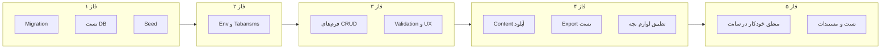

# چک‌لیست تکمیل سایت Cold Cake (نسخه ۴)

این فایل فقط کارهای مربوط به **خود سایت** را پوشش می‌دهد. طراحی و ساخت workflowها در n8n در scope این چک‌لیست نیست.

**آخرین بروزرسانی:** ۳۱ ژانویه ۲۰۲۵

---

## برنامه‌ریزی (فازها و ترتیب اجرا)

ترتیب اجرا و وابستگی فازها:

- **فاز ۱ – دیتابیس و پایه:** Migration کامل (همه مدل‌های schema)، تست اتصال، Seed
- **فاز ۲ – محیط:** بررسی Environment Variables، تست Tabansms
- **فاز ۳ – فرم‌ها و UX:** فرم‌های CRUD (مشتری، محصول، فروش، بدهی، بانک)، Validation، Loading، پیام خطا
- **فاز ۴ – تکمیل قابلیت‌ها:** آپلود واقعی محتوا، تست و رفع باگ Export، تطبیق با لوازم بچه و سیسمونی
- **فاز ۵ – منطق و تست:** بهبود منطق درون‌سایتی (قیمت طلا، messageGenerator، پرفروش‌ترین)، تست کلی، مستندات (در حد لازم)

---

## چک‌لیست تفصیلی

### فاز ۱ – دیتابیس و پایه

- [x] ایجاد migration جدید برای تمام مدل‌های موجود در [prisma/schema.prisma](prisma/schema.prisma) (migration جدید: `20250131120000_add_business_models`)
- [ ] اجرای `npx prisma migrate dev` (یا `npx prisma migrate deploy` در production) — وقتی دیتابیس در دسترس است
- [x] تست اتصال Prisma به دیتابیس (از طریق `GET /api/health` انجام می‌شود)
- [x] به‌روزرسانی [prisma/seed.ts](prisma/seed.ts): ایجاد حداقل یک User، ۵–۱۰ Customer، ۱۰–۱۵ Product، چند Sale و Debt (و BankAccount/Transaction و یک پست بلاگ برای فروشگاه)
- [ ] اجرای `npx prisma db seed` و اطمینان از عدم خطا — بعد از اجرای migrate

### فاز ۲ – محیط

- [ ] مطمئن شدن از وجود و مقدار همه متغیرهای مورد نیاز در `.env.local` / Runflare (مرجع: [docs/ENVIRONMENT_VARIABLES.md](docs/ENVIRONMENT_VARIABLES.md))
- [ ] تست ارسال SMS OTP با Tabansms (درخواست کد از صفحه لاگین و دریافت واقعی SMS)

### فاز ۳ – فرم‌های CRUD و UX

- [x] **مشتری:** در صفحه [app/messages/page.tsx](app/messages/page.tsx) تب لیست مشتریان: دکمه «افزودن مشتری» + Modal فرم، دکمه ویرایش + Modal، دکمه حذف با تأیید
- [x] **محصولات:** در [app/products/page.tsx](app/products/page.tsx): لیست محصولات، فرم افزودن محصول، فرم ویرایش محصول، دکمه حذف با تأیید
- [x] **فروش:** فرم ثبت فروش (انتخاب مشتری، انتخاب محصولات و تعداد، محاسبه مبلغ، ذخیره) در صفحه Reports تب Forms
- [x] **بدهی:** در صفحه Reports تب Debts: فرم ثبت بدهی (انتخاب مشتری، مبلغ، تاریخ سررسید، نوع received/paid)
- [x] **حساب بانکی:** در صفحه Reports تب Bank Ledger: افزودن حساب بانکی، افزودن تراکنش، حذف تراکنش (API ویرایش تراکنش در [app/api/bank-transactions/[id]/route.ts](app/api/bank-transactions/[id]/route.ts) موجود است)
- [x] **Validation:** اعتبارسنجی فیلدهای اجباری و فرمت برای تمام فرم‌های بالا (محصول: نام و قیمت عددی؛ فروش: مشتری و آیتم‌ها؛ بدهی: مشتری و مبلغ؛ بانک: شماره حساب و مبلغ؛ مشتری: نام و نام خانوادگی؛ toast موفقیت برای فروش و بدهی)
- [x] **Loading و خطا:** نمایش loading در حین ارسال فرم/درخواست، نمایش پیام خطا/موفقیت قابل فهم برای کاربر (در تمام فرم‌ها انجام شده)

### فاز ۴ – تکمیل قابلیت‌ها

- [x] **Content:** در [app/content/page.tsx](app/content/page.tsx) جایگزینی آپلود موقت با آپلود واقعی از طریق [app/api/upload/route.ts](app/api/upload/route.ts) (ذخیره در `public/uploads`) و ذخیره URL در دیتابیس
- [ ] **Export:** تست خروجی Excel/PDF برای Summary، Sales، Debts، Inventory، Bank Ledger از [app/api/reports/export](app/api/reports/export) و [app/api/bank-ledger/export](app/api/bank-ledger/export)؛ رفع باگ encoding/فرمت در صورت نیاز (خروجی در فرانت با xlsx/jspdf تولید می‌شود)
- [x] **تطبیق لوازم بچه و سیسمونی:** به‌روزرسانی دسته‌بندی و placeholder محصولات در [app/products/page.tsx](app/products/page.tsx)، placeholder در [app/maps-scraper/page.tsx](app/maps-scraper/page.tsx) («فروشگاه لوازم بچه»)، به‌روزرسانی محصولات و علاقه‌مندی مشتریان در [prisma/seed.ts](prisma/seed.ts)، [lib/utils/messageGenerator.ts](lib/utils/messageGenerator.ts) از قبل با سیسمونی سازگار بود

### فاز ۵ – منطق درون‌سایتی و تست

- [ ] **قیمت طلا:** اطمینان از کارکرد endpointهای [app/api/gold-price](app/api/gold-price) و منطق [lib/utils/goldPriceManager.ts](lib/utils/goldPriceManager.ts) (در حد لازم برای سایت؛ بدون طراحی workflow جدا)
- [ ] **پیام و پیشنهاد:** بهبود متن در [lib/utils/messageGenerator.ts](lib/utils/messageGenerator.ts) و در صورت نیاز تابع پرفروش‌ترین در [lib/services/sale.service.ts](lib/services/sale.service.ts) / [lib/utils/automatedMessaging.ts](lib/utils/automatedMessaging.ts) برای استفاده در سایت
- [ ] **تست کلی:** تست دستی یا ساده برای: لاگین، CRUD مشتری/محصول/فروش/بدهی، گزارش‌ها و Export، احراز هویت و محافظت مسیرها
- [ ] **مستندات:** در صورت نیاز به‌روزرسانی [docs/ENVIRONMENT_VARIABLES.md](docs/ENVIRONMENT_VARIABLES.md)؛ بقیه مستندات (API، راهنمای کاربر) در حد اختیاری

### اختیاری / بعداً

- [ ] صفحه Workflows: اتصال به n8n برای نمایش لیست (فعلاً بدون ساخت خود workflowها)
- [ ] پیاده‌سازی SEO برای صفحات فروشگاه و بلاگ ([todo-v3.md](todo-v3.md) آخرین مورد)

---

## موارد خارج از scope این چک‌لیست

- طراحی و ساخت خود workflowها در n8n
- یکپارچه‌سازی مستقیم با شبکه‌های اجتماعی (Instagram, YouTube, Aparat, Rubika و غیره) به‌صورت جداگانه
